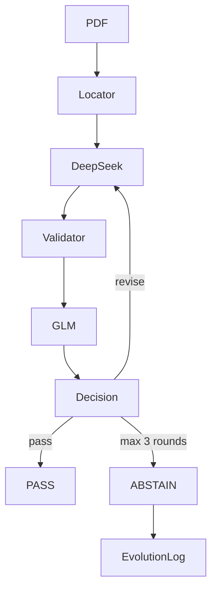

# ni43101-adversarial-audit

[English](README.md) | [简体中文](README-CN.md)

## 1. 工程讲解

### 1.1 问题与边界

这是一个 24 小时 MVP，用于从 NI 43-101 技术报告 PDF 中抽取并对抗审核 **Mineral Resources（矿产资源量）**。

目标只有：

- Indicated Mineral Resources（指示资源量）；
- Inferred Mineral Resources（推断资源量）。

禁止作为最终目标：Measured、Measured + Indicated、Proven、Probable 和 Mineral Reserves。

Resources 和 Reserves 不是同一概念。即使 Reserve 表中出现“Indicated Mineral Resource”文字，也不能把 Proven/Probable Reserve 记录当成目标。

最终字段：

- 矿石量统一为 `Mt`；
- 金品位为 `g/t Au`，含金量统一为 `oz`；
- 铜品位为 `% Cu`，含铜量统一为 `t`。

### 1.2 架构



Candidate Page Locator 只向模型提供 Top-3 候选页及前后一页的去重上下文，不会发送整份 PDF。

### 1.3 交付清单核对

| 交付要求 | 实现 | 强制保障 | 主要产物 |
|---|---|---|---|
| Extractor Agent | `DeepSeekExtractor` + `deepseek-chat` | Pydantic `ExtractionResult`；保留原始单位；限定 Indicated/Inferred | Raw extraction |
| CriticMaster Agent | `CriticMaster` + `glm-4.7-flash` | 与 Extractor 同模型时拒绝启动；确定性硬失败将评分封顶为 7 | 1–10 评分、8 维检查、Issues |
| Revise Loop | `NI43101Orchestrator` | 业务轮次硬限 1–3；通过阈值硬限 8–10；使用 `for range(...)` | PASS 或 ABSTAIN |
| Evolution Log | `EvolutionLogger` + `EvolutionFewShotSelector` | JSONL append-only；写入失败不影响 Pipeline；默认排除同文档 | `evolution.jsonl` |
| 评分协议 | `Evaluator` | 只有 Evaluator 读 Ground Truth；CLI 容差硬限为 `5%`；错误 PASS 记为 Unsafe Accept | `outputs/evaluation_report.json` |

### 1.4 Extractor Agent 验收点

Extractor 只做“读表 + 保留原始值”，不做单位计算。例如源表的 `8000 kt / 3.40 g/t Au / 870 koz` 保持为 Raw 值，之后再由 Python 转换。

每条 Raw Record 必须包含：

- `location`、`category`、`commodity`；
- tonnage / grade / metal 的原始数值和单位；
- `source_page`、`table_title`、`evidence_text`；
- `confidence`；
- 证据不清时的 `uncertain=true` 和原因。

Pydantic schema 会拒绝 Measured、Measured + Indicated、Proven 和 Probable。

### 1.5 CriticMaster Agent 验收点

GLM 不是第二个 Extractor，它主动查找风险，必须返回 1–10 评分并检查：

1. `resource_vs_reserve`；
2. `category_alignment`；
3. `row_alignment`；
4. `commodity_alignment`；
5. `unit_correctness`；
6. `math_consistency`；
7. `evidence_support`；
8. `completeness`。

Critic 输入只有候选页证据、DeepSeek Raw Extraction、归一化记录和 Python Validator 结果，绝不包含 Ground Truth。

Python 安全门不盲信 GLM：若数学误差大于 10% 或有其他确定性 `HARD_FAIL`，即使 GLM 返回 9/10，代码也会把评分封顶为 7 并阻止 PASS。

### 1.6 Revise Loop 与 ABSTAIN 验收点

业务轮次最多共 3 次：

- Round 1：初始抽取；
- Round 2：Revision #1；
- Round 3：Revision #2。

PASS 必须同时满足：

- Critic score `>= PASS_SCORE`，且 `PASS_SCORE >= 8`；
- Critic verdict 为 `pass`；
- 至少有一条目标记录；
- 没有 deterministic `HARD_FAIL`；
- Extraction 和每条 Record 都不是 uncertain；
- 没有 unresolved critical issue。

否则进入修订；最后一轮仍不安全则：

```text
status = abstain
needs_human_review = true
accepted_records = []
candidate_records = 最后一轮 Raw Extraction
```

Revision Prompt 要求 DeepSeek 重新查看原始证据，不能盲目接受 Critic 的建议值；仍无法确认时必须标记 uncertain，不能猜数字。

### 1.7 Evolution Log 验收点

以下情况会记录失败模式：

- revise；
- abstain；
- validator `HARD_FAIL`；
- Critic critical issue；
- LLM 格式错误；
- Ground Truth evaluation failed。

`evolution.jsonl` 每行是一个独立 JSON Object，使用 OS append 写入，不会覆盖历史。日志写入失败只会 warning，不会改变 Extractor、Critic 或 Pipeline Decision。

Evolution Few-shot 最多选择 3 个相似历史 Case，只注入 Previous extraction mistake、Critic finding 和 Lesson。它不注入 Ground Truth 数值，并默认排除与当前 `document_id` 相同的 Case。

### 1.8 评分协议验收点

Ground Truth 只由 `evaluator.py` 读取。记录先按以下 Key 匹配：

```text
normalized location + exact category + exact commodity
```

Location 允许大小写、重复空格和简单标点差异；Category 和 Commodity 不允许 fuzzy matching。

三个核心数值字段是 `tonnage_mt`、`grade` 和 `contained_metal`。字段正确条件：

```text
abs(prediction - truth) / abs(truth) <= 0.05
```

`truth=100` 时，`105` 通过，`105.1` 失败。

**Unsafe Accept** 是最重要的安全指标：Pipeline 返回 PASS，但有数值错误、缺失记录或多余记录，均记为 Unsafe Accept。ABSTAIN 不计为正确抽取，但不增加 Unsafe Accept。

## 2. Anaconda 安装

```bash
conda create -n ni43101-audit python=3.11 -y
conda activate ni43101-audit
pip install -r requirements.txt
pip install -e . --no-deps
```

检查安装：

```bash
python --version
python -c "import ni43101; print(ni43101.__file__)"
python -m ni43101.cli --help
```

创建本地配置：

```bash
cp .env.example .env
```

在 `.env` 中填写：

```dotenv
EXTRACTOR_API_KEY=your_deepseek_key
EXTRACTOR_BASE_URL=https://api.deepseek.com
EXTRACTOR_MODEL=deepseek-chat

CRITIC_API_KEY=your_glm_key
CRITIC_BASE_URL=https://open.bigmodel.cn/api/paas/v4
CRITIC_MODEL=glm-4.7-flash

MAX_REVISE_ROUNDS=3
PASS_SCORE=8
FIELD_TOLERANCE=0.05
```

必须填写 `.env`，不是 `.env.example`。`CRITIC_BASE_URL` 不要追加 `/chat/completions`。`.env` 已被 Git 忽略，不要提交密钥。

## 3. 操作指令

### 3.1 运行无 LLM 单元测试

```bash
python -m pytest -q
```

测试全部使用 Fake Client，不会调用真实 DeepSeek 或 GLM API。

### 3.2 检查 Candidate Locator

```bash
python -m ni43101.pdf_locator data/pdfs/Tanami-TR-12312018.pdf --top-k 5
```

输出页码、评分、正向关键词、负向关键词和评分原因，不调用 LLM。

### 3.3 使用 Extractor + CriticMaster

```bash
python -m ni43101.cli extract data/pdfs/Barrick_RekoDiq_TechnicalReport_20241231.pdf
```

该命令串行运行 Locator、DeepSeek、Validator、GLM 和 Decision，默认显示中文阶段进度和已用时间。机器可读结果写入：

```text
outputs/runs/<document_id>.json
```

安全调试输出：

```bash
python -m ni43101.cli extract data/pdfs/Barrick_RekoDiq_TechnicalReport_20241231.pdf --debug
```

`--debug` 显示 Candidate Scores、Raw Extraction、Normalized Records、Validator Results、Critic Issues 和 Revision Reason，不显示 API Key。

脚本或 CI 中可关闭进度：

```bash
python -m ni43101.cli extract data/pdfs/Barrick_RekoDiq_TechnicalReport_20241231.pdf --no-progress
```

不流式打印模型的半成品 JSON；只有完整响应通过 Pydantic 验证后才进入后续 Pipeline。

### 3.4 验收 Revise Loop / ABSTAIN

打开输出 JSON 的 `rounds` 即可检查每轮：

```text
round_number
extractor_result
normalized_records
validator_results
critic_result
decision
```

终端进度会显示“第 N/3 轮”。结果为 ABSTAIN 时，应检查：

```text
status == "abstain"
needs_human_review == true
accepted_records == []
candidate_records != []  # 如果最后一轮有 Raw Record
```

### 3.5 验收 Evolution Log

先运行抽取或 Baseline；出现 revise / abstain / 评估失败时会 append。检查行数：

```bash
wc -l evolution.jsonl
```

检查每行都是 JSON：

```bash
python -c "import orjson; from pathlib import Path; lines=Path('evolution.jsonl').read_bytes().splitlines(); [orjson.loads(line) for line in lines]; print(f'{len(lines)} valid JSONL records')"
```

启用历史 Lesson 的单 PDF 抽取：

```bash
python -m ni43101.cli extract data/pdfs/Tanami-TR-12312018.pdf --fewshot evolution
```

### 3.6 准备 Ground Truth

每个 `data/pdfs/*.pdf` 都必须有对应 JSON，其 `document_id` 必须等于 PDF 文件名去掉 `.pdf` 后的 stem。

```json
{
  "document_id": "example-report",
  "records": [
    {
      "location": "Example Deposit",
      "category": "Indicated",
      "commodity": "Au",
      "tonnage_mt": 8.0,
      "grade": 3.4,
      "grade_unit": "g/t Au",
      "contained_metal": 870000,
      "metal_unit": "oz"
    }
  ]
}
```

Ground Truth 必须来自人工核对或题目提供的答案，不能直接把 LLM 输出复制成标准答案。

### 3.7 Baseline 评估

```bash
python -m ni43101.cli evaluate --pdf-dir data/pdfs --gt-dir data/ground_truth --fewshot off
```

输出：

- 终端：Field Accuracy、Abstain Rate、Unsafe Accept Rate；
- `outputs/runs/baseline/`：每份 PDF 的 PipelineResult；
- `outputs/evaluation_report.json`：机器可读评估指标；
- `evolution.jsonl`：失败评估 Case。

只离线评估已有 PipelineResult、不重新调用 LLM：

```bash
python -m ni43101.evaluator outputs/runs/Barrick_RekoDiq_TechnicalReport_20241231.json --ground-truth-dir data/ground_truth
```

### 3.8 Evolution Few-shot 对比

第一步，用独立 Baseline 运行积累历史失败 Lesson：

```bash
python -m ni43101.cli evaluate --pdf-dir data/pdfs --gt-dir data/ground_truth --fewshot off
```

第二步，启动新的对比运行：

```bash
python -m ni43101.cli evaluate --pdf-dir data/pdfs --gt-dir data/ground_truth --fewshot evolution
```

对比运行会在启动时冻结已有 `evolution.jsonl` 快照，防止同一次运行中的新结果泄漏给后续文档。报告对比：

- Baseline / Evolution Field Accuracy；
- Baseline / Evolution Abstain Rate；
- Baseline / Evolution Unsafe Accept Rate。

### 3.9 交付验收顺序

```bash
python -m pytest -q
python -m ni43101.pdf_locator data/pdfs/Barrick_RekoDiq_TechnicalReport_20241231.pdf --top-k 5
python -m ni43101.cli extract data/pdfs/Barrick_RekoDiq_TechnicalReport_20241231.pdf --debug
python -m ni43101.cli evaluate --pdf-dir data/pdfs --gt-dir data/ground_truth --fewshot off
python -m ni43101.cli evaluate --pdf-dir data/pdfs --gt-dir data/ground_truth --fewshot evolution
```
