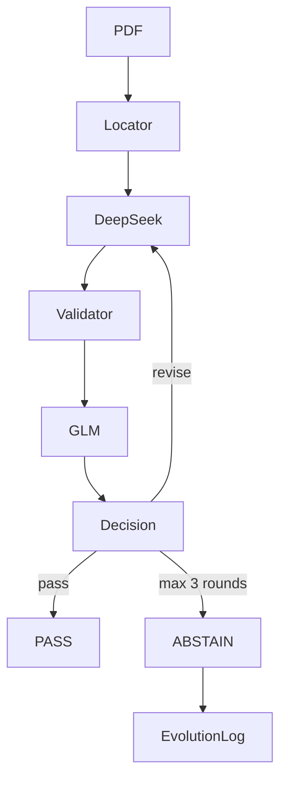

# ni43101-adversarial-audit

[English](README.md) | [简体中文](README-CN.md)

## 1. Project explanation

### 1.1 Scope and architecture

This 24-hour MVP extracts and adversarially audits **Mineral Resources** from NI 43-101 PDFs. The only target categories are Indicated and Inferred. Measured, Measured + Indicated, Proven, Probable, and Mineral Reserves are never final targets.

Outputs are normalized to ore tonnage in `Mt`, gold grade in `g/t Au`, copper grade in `% Cu`, contained gold in `oz`, and contained copper in `t`.



Only the top three candidate pages plus deduplicated one-page neighbors are sent to the models. The complete PDF is never sent.

### 1.2 Delivery checklist

| Requirement | Implementation | Enforced safety rule | Output |
|---|---|---|---|
| Extractor Agent | `DeepSeekExtractor` using `deepseek-chat` | Pydantic `ExtractionResult`, original units retained, target categories constrained | Raw extraction |
| CriticMaster Agent | `CriticMaster` using `glm-4.7-flash` | Must differ from Extractor; deterministic hard failures cap score at 7 | Score 1-10, eight checks, issues |
| Revise Loop | `NI43101Orchestrator` | 1-3 total business rounds; pass threshold constrained to 8-10 | PASS or ABSTAIN |
| Evolution Log | `EvolutionLogger` and `EvolutionFewShotSelector` | Append-only JSONL, non-blocking writes, same document excluded by default | `evolution.jsonl` |
| Scoring protocol | `Evaluator` | Evaluator-only Ground Truth access, CLI tolerance fixed at `5%`, unsafe-pass detection | `outputs/evaluation_report.json` |

### 1.3 Extractor Agent acceptance

The Extractor reads tables and preserves source values; it does not normalize units. Every raw record includes location, category, commodity, source values and units, source page, table title, evidence, confidence, and explicit uncertainty when needed. Pydantic rejects non-target categories.

### 1.4 CriticMaster Agent acceptance

GLM is an adversarial reviewer, not a second extractor. It checks:

1. resource vs reserve;
2. category alignment;
3. row alignment;
4. commodity alignment;
5. unit correctness;
6. math consistency;
7. evidence support;
8. completeness.

Critic input contains only candidate evidence, DeepSeek raw extraction, normalized records, and deterministic validator results. Ground Truth is never included.

A deterministic `HARD_FAIL` or numeric error above 10% caps the Critic score at 7 even if the model returns 9 or 10.

### 1.5 Revise Loop and ABSTAIN acceptance

The pipeline executes at most three total Extractor-to-Critic rounds: initial extraction, revision 1, and revision 2.

PASS requires all of the following:

- a non-empty extraction;
- score at least `PASS_SCORE`, which cannot be configured below 8;
- Critic verdict `pass`;
- no deterministic `HARD_FAIL`;
- no extraction or record uncertainty;
- no unresolved critical issue.

After the final unsafe round, the result is `status=abstain`, `needs_human_review=true`, and `accepted_records=[]`. The final raw extraction remains only in `candidate_records` for human review.

### 1.6 Evolution Log acceptance

Revise, abstain, validator hard failure, Critic critical issue, LLM format failure, and failed Ground Truth evaluation are captured as failure patterns. Each event is appended as one JSON object per line. Logging failure emits a warning but cannot change the pipeline decision.

Few-shot replay selects at most three similar cases and provides only previous mistake patterns, Critic findings, and lessons. It never injects Ground Truth values and excludes the current document by default.

### 1.7 Scoring protocol acceptance

Only `evaluator.py` reads Ground Truth. Records match on normalized location plus exact category and commodity. The core fields are `tonnage_mt`, `grade`, and `contained_metal`; a field is correct when relative error is at most 5%.

A PASS containing any numeric, missing-record, or unexpected-record error is an Unsafe Accept. ABSTAIN is not a correct extraction, but does not increase Unsafe Accept.

## 2. Anaconda setup

```bash
conda create -n ni43101-audit python=3.11 -y
conda activate ni43101-audit
pip install -r requirements.txt
pip install -e . --no-deps
```

Verify installation:

```bash
python --version
python -c "import ni43101; print(ni43101.__file__)"
python -m ni43101.cli --help
```

Create and fill `.env`:

```bash
cp .env.example .env
```

```dotenv
EXTRACTOR_API_KEY=your_deepseek_key
EXTRACTOR_BASE_URL=https://api.deepseek.com
EXTRACTOR_MODEL=deepseek-chat

CRITIC_API_KEY=your_glm_key
CRITIC_BASE_URL=https://open.bigmodel.cn/api/paas/v4
CRITIC_MODEL=glm-4.7-flash

MAX_REVISE_ROUNDS=3
PASS_SCORE=8
FIELD_TOLERANCE=0.05
```

Fill `.env`, not `.env.example`. Do not append `/chat/completions` to the Critic base URL. `.env` is ignored by Git and must never be committed.

## 3. Commands

### 3.1 Tests and Candidate Locator

All tests use fake model clients and make no real API calls:

```bash
python -m pytest -q
```

Inspect candidate pages without an LLM call:

```bash
python -m ni43101.pdf_locator data/pdfs/Barrick_RekoDiq_TechnicalReport_20241231.pdf --top-k 5
```

### 3.2 Use the Extractor and CriticMaster

```bash
python -m ni43101.cli extract data/pdfs/Barrick_RekoDiq_TechnicalReport_20241231.pdf
```

The CLI runs Locator, DeepSeek, Validator, GLM, and Decision, while showing Chinese stage progress and elapsed time. The machine-readable result is written to `outputs/runs/<document_id>.json`.

Inspect candidate scores, raw extraction, normalized records, validator results, Critic issues, and revision reasons:

```bash
python -m ni43101.cli extract data/pdfs/Barrick_RekoDiq_TechnicalReport_20241231.pdf --debug
```

Disable progress for CI:

```bash
python -m ni43101.cli extract data/pdfs/Barrick_RekoDiq_TechnicalReport_20241231.pdf --no-progress
```

Partial model JSON is not streamed. A complete response must pass local Pydantic validation before entering the remaining pipeline.

### 3.3 Verify Revise Loop and ABSTAIN

Inspect the result JSON `rounds`: every entry contains the round number, extractor result, normalized records, validators, Critic result, and decision.

An ABSTAIN must have:

```text
status == "abstain"
needs_human_review == true
accepted_records == []
```

### 3.4 Use and inspect the Evolution Log

```bash
wc -l evolution.jsonl
python -c "import orjson; from pathlib import Path; lines=Path('evolution.jsonl').read_bytes().splitlines(); [orjson.loads(line) for line in lines]; print(f'{len(lines)} valid JSONL records')"
```

Use historical lessons for one extraction:

```bash
python -m ni43101.cli extract data/pdfs/Tanami-TR-12312018.pdf --fewshot evolution
```

### 3.5 Ground Truth and baseline evaluation

Every `data/pdfs/*.pdf` must have a Ground Truth JSON whose `document_id` equals the PDF filename stem. Ground Truth must be independently human-verified, not copied from model output.

```bash
python -m ni43101.cli evaluate --pdf-dir data/pdfs --gt-dir data/ground_truth --fewshot off
```

This prints Field Accuracy, Abstain Rate, and Unsafe Accept Rate, writes per-document results under `outputs/runs/baseline/`, and writes metrics to `outputs/evaluation_report.json`.

Evaluate an existing PipelineResult without new LLM calls:

```bash
python -m ni43101.evaluator outputs/runs/Barrick_RekoDiq_TechnicalReport_20241231.json --ground-truth-dir data/ground_truth
```

### 3.6 Baseline versus Evolution replay

First run baseline in a separate invocation so historical lessons exist. Then run comparison:

```bash
python -m ni43101.cli evaluate --pdf-dir data/pdfs --gt-dir data/ground_truth --fewshot off
python -m ni43101.cli evaluate --pdf-dir data/pdfs --gt-dir data/ground_truth --fewshot evolution
```

The comparison freezes the pre-existing Evolution snapshot and reports Baseline versus Evolution Field Accuracy, Abstain Rate, and Unsafe Accept Rate.
